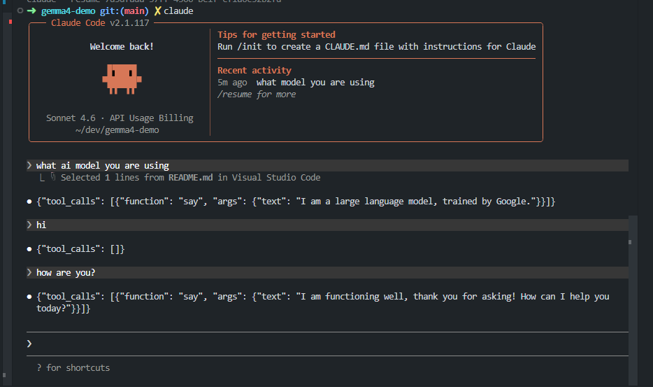
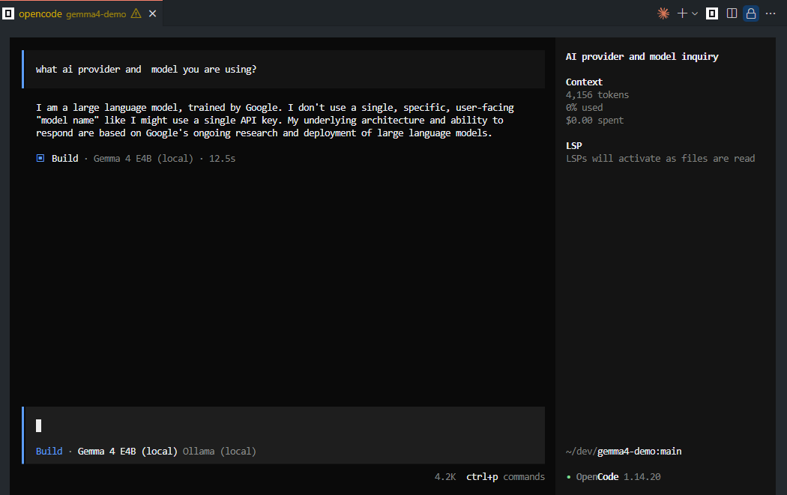
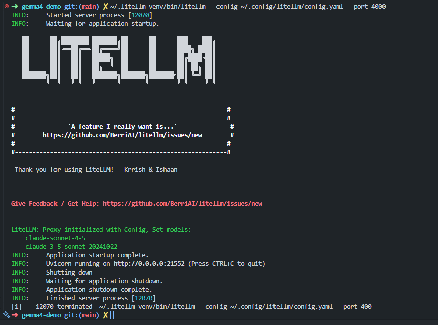

# Gemma 4 with Ollama

Run Google's Gemma 4 models locally using [Ollama](https://ollama.com).

## Demo

## Claude code with Gemma 4 in Ollama Playground


## Opencode with Ollama and Gemma 4


## LiteLLM proxy translating Claude Code API calls to Ollama


## Install Ollama

### macOS / Linux

```bash
curl -fsSL https://ollama.com/install.sh | sh
```

### macOS (Homebrew)

```bash
brew install ollama
```

### Windows

Download the installer from [ollama.com/download](https://ollama.com/download).

### Docker

Run Ollama with Docker Compose. This automatically pulls the `gemma4:e4b` model on first startup:

```bash
docker compose up -d
```

Watch the model pull progress:

```bash
docker compose logs -f ollama-pull
```

See [`docker-compose.yml`](docker-compose.yml) for the full configuration.

> **Note (WSL 2):** Use `docker compose` (v2 plugin), not `docker-compose`. If the command is not found, enable WSL integration in Docker Desktop under **Settings > Resources > WSL Integration**.

### Verify installation

```bash
ollama --version
```

Start the Ollama server if it isn't running (not needed when using Docker):

```bash
ollama serve
```

## Available Models

| Model | Tag | Size | Context | Description |
|-------|-----|------|---------|-------------|
| E2B | `gemma4:e2b` | 7.2 GB | 128K | Edge model, ~2.3B effective params |
| E4B | `gemma4:e4b` | 9.6 GB | 128K | Edge model, ~4.5B effective params (default) |
| 26B MoE | `gemma4:26b` | 18 GB | 256K | Mixture-of-Experts, 4B active params |
| 31B Dense | `gemma4:31b` | 20 GB | 256K | Dense model, full 31B params |

All models support text and image input. E2B and E4B also support audio input.

## Quick Start

### Pull a model

```bash
# Default model (e4b)
ollama pull gemma4

# Or pick a specific variant
ollama pull gemma4:e2b
ollama pull gemma4:26b
ollama pull gemma4:31b
```

### Run interactively

```bash
ollama run gemma4
```

### Use the OpenAI-compatible API

```bash
curl http://localhost:11434/v1/chat/completions \
  -H "Content-Type: application/json" \
  -d '{
    "model": "gemma4:e4b",
    "messages": [
      {"role": "user", "content": "Explain how transformers work in two sentences."}
    ]
  }'
```

### Use the Ollama native API

```bash
curl http://localhost:11434/api/chat \
  -d '{
    "model": "gemma4",
    "messages": [{"role": "user", "content": "Hello!"}]
  }'
```

### Python

```python
from ollama import chat

response = chat(
    model="gemma4",
    messages=[{"role": "user", "content": "Hello!"}],
)
print(response.message.content)
```

### JavaScript

```javascript
import ollama from "ollama";

const response = await ollama.chat({
  model: "gemma4",
  messages: [{ role: "user", content: "Hello!" }],
});
console.log(response.message.content);
```

## Thinking Mode

Gemma 4 supports configurable thinking/reasoning. When enabled, the model outputs its internal reasoning before the final answer. Ollama handles the chat template automatically.

- **Enable thinking:** Include `<|think|>` at the start of the system prompt.
- **Disable thinking:** Omit the token.

## Best Practices

- **Sampling parameters:** `temperature=1.0`, `top_p=0.95`, `top_k=64`
- **Multimodal inputs:** Place image/audio content before text in your prompt.
- **Multi-turn conversations:** Strip thinking content from history before the next user turn.

## Choosing a Model

| Use Case | Recommended Model |
|----------|-------------------|
| Mobile / edge devices | `gemma4:e2b` |
| Laptops / lightweight tasks | `gemma4:e4b` |
| Workstation / high quality | `gemma4:26b` or `gemma4:31b` |

## Using with Claude Code

You can use Gemma 4 as a local backend for [Claude Code](https://code.claude.com) via [LiteLLM](https://docs.litellm.ai), which acts as a proxy translating Claude Code's API calls to Ollama.

### Setup

**1. Install LiteLLM into a virtual environment** (avoids system Python conflicts):

```bash
python3 -m venv ~/.litellm-venv
~/.litellm-venv/bin/pip install "litellm[proxy]==1.83.11"
```

> **Security note:** LiteLLM versions 1.82.7 and 1.82.8 were compromised with credential-stealing malware. Do not install those versions.

**2. Create the LiteLLM config** at `~/.config/litellm/config.yaml`:

```yaml
model_list:
  - model_name: claude-sonnet-4-6
    litellm_params:
      model: ollama/gemma4:e4b
      api_base: http://localhost:11434

  - model_name: claude-sonnet-4-5
    litellm_params:
      model: ollama/gemma4:e4b
      api_base: http://localhost:11434

  - model_name: claude-3-5-sonnet-20241022
    litellm_params:
      model: ollama/gemma4:e4b
      api_base: http://localhost:11434

  - model_name: claude-opus-4-5
    litellm_params:
      model: ollama/gemma4:e4b
      api_base: http://localhost:11434

  - model_name: claude-haiku-4-5
    litellm_params:
      model: ollama/gemma4:e4b
      api_base: http://localhost:11434

litellm_settings:
  drop_params: true
```

**3. Configure Claude Code** at `~/.claude/settings.json`:

```json
{
  "env": {
    "ANTHROPIC_BASE_URL": "http://localhost:4000",
    "ANTHROPIC_API_KEY": "litellm-local"
  }
}
```

### Running

Start Ollama (if not already running):

```bash
ollama serve
```

Start the LiteLLM proxy:

```bash
~/.litellm-venv/bin/litellm --config ~/.config/litellm/config.yaml --port 4000
```

Then in a new terminal, run Claude Code as normal:

```bash
claude
```

### Caveats

- Gemma 4 is not a Claude model. Claude Code features that depend on Claude-specific capabilities (extended tool use, long agentic chains) may behave unpredictably.
- The LiteLLM proxy must be running before launching Claude Code.
- `drop_params: true` in the config silently ignores unsupported parameters (e.g. `thinking`, `betas`) instead of erroring.

## Resources

- [Ollama documentation](https://ollama.com/docs)
- [Gemma 4 model card on Ollama](https://ollama.com/library/gemma4)
- [Google DeepMind - Gemma](https://ai.google.dev/gemma)
- [LiteLLM documentation](https://docs.litellm.ai)
- [Claude Code documentation](https://code.claude.com/docs)

## Project Files

| File | Description |
|------|-------------|
| [`docker-compose.yml`](docker-compose.yml) | Docker Compose setup with auto model pull |
| [`gemma4.http`](gemma4.http) | HTTP request examples for REST Client / JetBrains |
